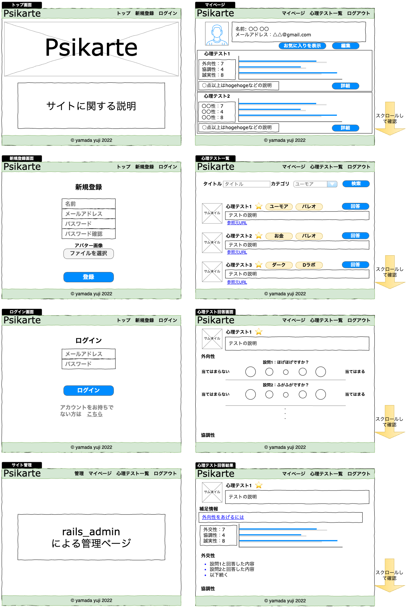
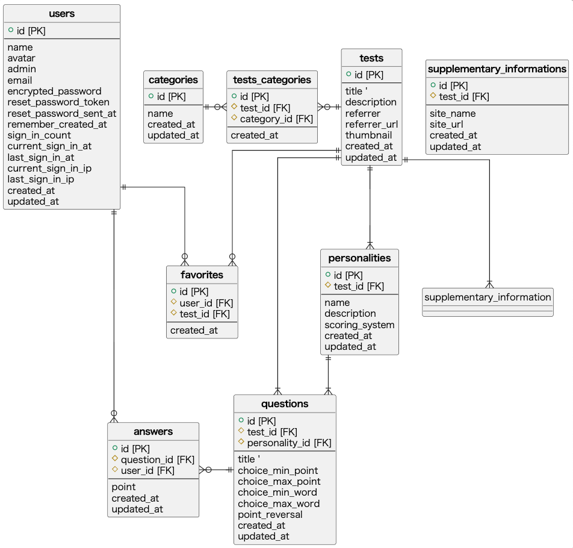
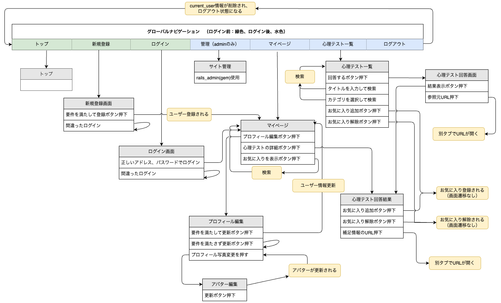

# README

## 開発言語
* Ruby 3.0.1
* Ruby on Rails 6.1.6

## 就業Termの技術
* Devise
* お気に入り機能

## カリキュラム外の技術
* gem rails_admin, gem cancancanを使った管理者機能
* gem ransackを利用した検索機能
* gem chartkickを利用したグラフ機能

## 実行手順

```
$ git clone git@github.com:ymdarudy/psikarte.git
$ cd psikarte
$ bundle
$ rails db:create db:migrate
$ rails db:seed
$ rails s
```

## カタログ設計, テーブル設計
https://docs.google.com/spreadsheets/d/1TEDiH__0xlwXfDFIAFpcVRhMCDg2fTgPC1nBJ0EO8-s/edit#gid=782464957


## ワイヤーフレーム
draw.ioリンク
https://drive.google.com/file/d/1E69mS4ZEJyVlhp7KPDb22VjElnhK-jTK/view?usp=sharing


## ER図　



## 画面遷移図
draw.ioリンク
https://drive.google.com/file/d/18fVDwUAbLggvkVWvX5i9IAUPNkntpHV4/view?usp=sharing


